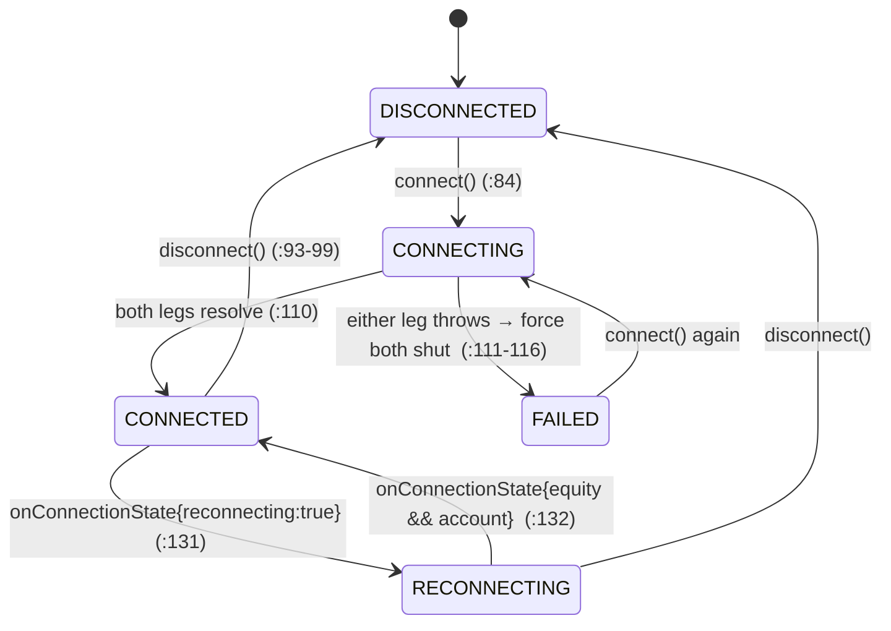
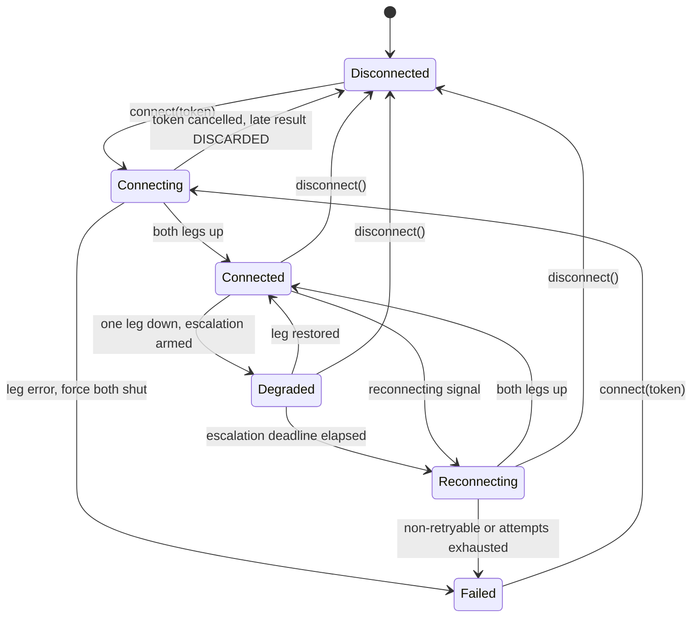

> **PROVENANCE — read before trusting this document.** This is a raw design-fleet lens
> report, authored 2026-07-25 by one of three independent agents run against
> `master @ 78bac1f` for Track X (RS-UP-1 plan amendment v1.1). It is **primary research,
> not ratified fact.** The authoring session re-verified its load-bearing claims at
> `file:line` before any of them entered the Problem Ledger (P-144 … P-152) or the
> synthesis document `trackx-experience-blueprint.md` — and **at least one framing
> inverted on verification** (the arming ceremony: the fleet read a missing typed-phrase
> ceremony as a weakened terminal; the code shows a deliberately *strengthened* one and
> stale documents — see P-148). Claims here that are **not** mirrored in a ledger entry
> have not been independently verified. Treat this file exactly as Directive 0.5 says to
> treat any pasted authority: the filesystem outranks it.

---

# Track X — LENS C: SYSTEMS DESIGN

```
[LENS]      C of 3 — state machines, contracts, Tauri substrate
[SCOPE]     The five Track X flows' MACHINERY. Siblings own safety policy (A) and
            operator experience (B). Everything below is states/transitions/contracts.
[MEASURED]  2026-07-25 against C:\Users\User\mc4-rust (worktree @ origin/master 78bac1f)
[METHOD]    Read the implementations end-to-end, not their docblocks. Every claim
            below cites file:line. Where a docblock and the code disagree, the code
            is quoted and the docblock is named as a defect (RS-L5 / §0.5).
[GOVERNS]   RS-UP-1 Appendix A.3 (Oracle levels), Appendix D (perimeter protocol),
            RS-8.x/9.x specs. Nothing here is a merge; this is a design input.
```

---

## §0 — WHAT I ACTUALLY READ

`kill-switch-store.ts` (89 ln) · `live-mode.ts` (70 ln) · `order-manager.ts` kill-switch
block (:171–203) · `alpaca/broker-session.ts` (143 ln) · `alpaca-reconnect.ts` (55 ln) ·
`autonomous-trader.ts` (271 ln) · `core/data-source-guard.ts` (21 ln) ·
`core/trading-engine.ts` at the three construction call-sites (:513–531, :1328–1408,
:1412–1453), teardown (:2082–2100), shutdown (:808–896) · `index.ts` RISK_KILL handler
(:702–744), quit path (:1164–1196) · `renderer/App.tsx` chord (:195–280) ·
`persistence.ts` open/close (:57–72, :1027–1038, :440–446) · `docs/plans/rs-ipc-inventory.md`.

The headline: **the four flows that matter most are not state machines at all.** They are
sets of booleans mutated from several call-sites, with the *guard* logic living in one
pure, well-tested function (`data-source-guard.ts`) and the *sequencing* logic living
nowhere. That asymmetry is the origin of every accidental state in §1.6.

---

## §1 — CURRENT-MACHINERY MAP

### 1.1 Kill switch — a boolean with two writers and a persistence side-channel

**De-facto states:** `armed ∈ {false, true}`, held in `order-manager.ts` as
`this.account.killSwitchArmed` (:104 initial, :166 read-out). Persisted separately as
`{armed, reason, armedAt, updatedAt}` in `userData/kill-switch.json`
(`kill-switch-store.ts:22–29`).

**Transitions:**

| From | Event | To | Site | Persisted? |
|---|---|---|---|---|
| any | `armKillSwitch(reason)` | armed | `order-manager.ts:172–178` | via `killChangeCb` (:177) |
| armed | `disarmKillSwitch()` | disarmed | `:179–184` | via `killChangeCb` (:183) |
| disarmed | daily-loss breach in `applyFill` | armed | `:547` → `:199–200` | yes |
| disarmed | EOD flatten | armed | `trading-engine.ts:1090` | yes |
| disk-armed | boot `restoreKillSwitch` | armed | `:198–203` | **deliberately not** (:187–197) |

**The write contract is genuinely good.** `writeJsonAtomic` (`kill-switch-store.ts:62–76`)
is tmp-write → `renameSync`, with the failure path unlinking the orphan tmp (:73) and the
docblock recording *why* (a v0.4.3 truncate-then-write crash silently disarmed an armed
switch, :51–56). `armedAt` is preserved across re-arms (`:84`: `armed ? (prev.armed ?
prev.armedAt : now) : 0`). Load defaults to disarmed on missing/corrupt (`:41`) — the safe
direction, since a disarmed switch prevents nothing rather than blocking a real halt.

**Undesigned edges:**

- **The persistence sink is optional at the type level.** `order-manager` fires
  `this.killChangeCb?.(…)` (:177, :183) — an optional callback installed by
  `setOnKillSwitchChange` (:190). If that wire is ever omitted (a refactor, a new engine
  construction path), arm/disarm keeps working and silently stops persisting. Nothing in
  the type system requires the sink to exist. This is a wiring invariant maintained by
  discipline alone.
- **Arm is idempotent-by-early-return** (:173) — so a second `armKillSwitch('daily-loss')`
  after a manual arm does *not* update the reason. The reason field is first-writer-wins.
- **`restoreKillSwitch` fires the operational callbacks but not the persistence one**
  (:198–203) — correct, and the docblock explains it (:192–197). But it is the only
  transition that can reach `armed` without touching disk, which means the disk and memory
  can legitimately disagree on `updatedAt` forever. Harmless today; a trap for any future
  code that treats `updatedAt` as "last state change."

### 1.2 Live-capital arming — the interlock that skipped the atomic-write lesson

**De-facto states:** `Stored = {enabled, notionalCap, updatedAt}` in
`userData/live-mode.json` (`live-mode.ts:20`), loaded once into a module-level `let state`
(:35). Effective liveness is a *derived* value, not the stored flag:
`getLiveModeStatus` returns `enabled: state.enabled && !paperOnly` (:39) where `paperOnly`
is a substring test on the base URL (:38).

**Transitions:** `setLiveMode` (:42–66) — disable is unconditional (:44–49); enable
requires `!killArmed` (:57), daily-loss headroom (:58–59), and `0 < cap ≤ 50_000` (:60).
The typed-phrase human gate is **not in this file** — it lives upstream in the
`LIVE_MODE_SET` IPC handler as a native dialog (docblock :51–56, adversarial finding C6).
The structural interlocks are duplicated here deliberately so direct callers cannot
sidestep them (:53–56).

**Undesigned edges:**

- **`save()` at :31 is a bare `fs.writeFileSync`.** The kill switch's exported
  `writeJsonAtomic` (`kill-switch-store.ts:62`) exists precisely to close the
  truncate-then-crash hole, and its docblock says it was extracted so a regression test
  could drive it directly (:47–49). Live-mode never adopted it. A crash between truncate
  and write leaves a 0-byte `live-mode.json`; the next boot's `load()` catch (:27) returns
  `{enabled: false, notionalCap: 500}`. The *direction* is fail-safe (live disarms), so
  this is not a capital-safety hole — but it **silently resets the operator's notional cap
  to 500** with no surfaced event, and it means the two sibling interlock files ship two
  different durability contracts for the same class of state. Sibling files, one lesson,
  half-applied.
- **Two independent notions of "live"** must agree: `isLive()` (the typed-phrase flag,
  :68) and `getAlpacaMode() === 'live'` (the endpoint). `trading-engine.ts:1333` ORs them
  into `realCapitalArmed` for the data-source guard — correct — but `autonomous-trader`
  receives a *third* abstraction, `isLiveCapitalRouted()` (`autonomous-trader.ts:68`), and
  the `RISK_KILL` disarm gate keys off `isLive()` alone (`index.ts:719`). Three call-sites,
  three spellings of one predicate. Nothing today is wrong; the shape invites drift.
- **`state` is module-global and loaded exactly once at import (:35).** An external edit to
  `live-mode.json` while the app runs is ignored until restart; a *stale in-memory* enable
  survives a disk rollback.

### 1.3 Broker session + reconnect — a real FSM with a cancellation hole

This is the one flow with an explicit machine: `SessionState` ∈ `{DISCONNECTED,
CONNECTING, CONNECTED, RECONNECTING, FAILED}` (`broker-session.ts:38`), with listener
fanout that survives a throwing listener (:135–141) and dedup on identical state (:136).



**What is right:** the listener is subscribed *before* the connect calls so events during
the connect race are not lost (:102–104). The failure path force-stops both legs to avoid
an orphan WS when one succeeded and the other threw (:112–115). `disconnect()` drains
in-flight orders via `failUnacked` **first** (:94), then stops data and account streams
idempotently (:95–96). `computeReconnectDelay` (`alpaca-reconnect.ts:46–54`) is pure,
injected-clock, and takes `max(exponential backoff, remaining 406 cooldown)` — the 406
cooldown being load-bearing because hammering keeps the server-side orphan alive
(:9–20). Backoff 1s→30s cap, 60s cooldown (:23–31).

**Undesigned edges:**

- **`disconnect()` does not cancel an in-flight `runConnect()`.** `disconnect()` (:93) has
  no state guard and no handle on `connectPromise`. Sequence: `connect()` sets CONNECTING
  and awaits `Promise.all` (:106–109) → `disconnect()` runs fully and sets DISCONNECTED
  (:98) → the awaited legs resolve → `runConnect` sets **CONNECTED** (:110) on a session
  whose streams were just stopped. The machine now reports CONNECTED with nothing
  connected. Reachable from the engine, where `teardownSession()` (`trading-engine.ts:2093`)
  is called from both the switch and reconnect paths with no cross-exclusion (see 1.5).
- **A half-down session still reads CONNECTED.** `onConnectionState` (:127–133) acts on
  exactly two shapes: `reconnecting` → RECONNECTING, `equity && account` → CONNECTED.
  Everything else is *ignored by design* to avoid flapping (:128–130). So account-WS-down
  with equity-WS-up produces no transition at all: the session stays CONNECTED. The
  comment calls this the "transient drop window"; the code cannot distinguish transient
  from persistent, because there is no timer that escalates an ignored event.
- **No `DEGRADED` state exists.** The five states cannot express "up, but one leg is
  missing" — which is precisely the state the operator most needs named. Constitution §3.2
  ("degrade loudly, never silently") has no representation in this enum.
- **Consumers collapse the enum lossily.** `trading-engine.ts:973` maps
  `state === 'CONNECTED' ? 'live' : 'off'` — RECONNECTING reads as *off*; :1668 and :2169
  compute `connected = this.session ? state === 'CONNECTED' : true`, i.e. **no session
  means connected**. Defensible for the simulator (there is no broker to be down), but it
  means "connected" is true in three semantically different worlds.

### 1.4 Autonomous lifecycle — the timer chain that `stop()` cannot always stop

**De-facto states:** `status.enabled` (`autonomous-trader.ts:85`) × `cycling` (:80) ×
`timer !== null` (:79). Eight combinations exist; roughly four were designed.

**Transitions:** `start()` (:99–106) early-returns if enabled, sets `enabled`, calls
`scheduleNext()`. `stop()` (:108–114) clears `timer`, sets `enabled = false`.
`scheduleNext()` (:129–132) returns if disabled, else `this.timer = setTimeout(runCycle,
intervalMs)`. `runCycle()` (:134–162) re-entrancy-guards on `cycling` (:135), re-checks
`enabled` (:136), then in `finally` sets `cycling = false` and calls `scheduleNext()`
(:158–161).

**Undesigned edges — this flow has the most:**

- **A2 · Stop does not stop an in-flight cycle.** `enabled` is read once at cycle entry
  (:136); the watchlist loop (:152–155) then runs to completion, `await`-ing a brain
  decision and `submitOrder` per symbol (:226). An operator who hits stop mid-cycle can
  watch further orders appear. There is no cancellation token anywhere in the class.
- **A3 · The live-capital wall is cycle-granular, not order-granular.**
  `isLiveCapitalRouted()` is checked once at :141, before the loop. Real capital is still
  unreachable — `submitOrder` runs the 9-gate battery — but the trader's *own* wall does
  not hold for the duration of the work it guards.
- **A1 · `stop()` → `start()` during an in-flight cycle leaks an uncancellable timer
  chain.** Each cycle arms exactly one successor in its `finally` (:160), so normally there
  is one chain. But: cycle in flight (`cycling = true`) → `stop()` nulls `this.timer` →
  `start()` sets `enabled = true` and arms **T_A** (:102) → the in-flight cycle's `finally`
  calls `scheduleNext()` and **overwrites `this.timer` with T_B** (:131), orphaning T_A
  while it is still armed. T_A fires, `runCycle` sees `enabled = true`, and arms its own
  successor. Two self-sustaining chains now exist; `stop()` holds a handle to only one.
  The result is a permanently doubled cycle rate and a chain the operator cannot stop
  without a process restart. This is the §2.5.7 leak class expressed in scheduler form.
- **A4 · `setConfig` does not reschedule.** Changing `intervalMs` (:119–123) takes effect
  only after the current timer fires, so the reported config and the armed deadline
  disagree for up to the old interval.
- **Not persisted, and that is right.** `status` lives only in memory, so a crash leaves
  autonomous *off* — the opposite of the kill switch, and correct in both cases. Nothing
  documents this asymmetry as intentional; the Rust design should state it.

### 1.5 Data-source switch + session lifecycle — a pure guard around an unguarded sequence

**The guard is exemplary.** `evaluateDataSourceSwitch` (`data-source-guard.ts:14–21`) is
pure, I/O-free, and precedence-ordered: already-on → replay → real-capital → missing-creds.
Ordering is load-bearing (a no-op switch is permitted even while armed, because nothing
changes) and the file says so (:11–13).

**The sequence around it is not guarded.** `setDataSource` (`trading-engine.ts:1328`)
implements PREPARE (fallible REST auth, :1344–1352) → COMMIT (local, :1353–1372), and its
failure path is genuinely well built: if nothing was torn down, clean no-op; if teardown
already happened, fall back to a fresh simulator so the engine is never source-less
(:1386–1401). That is the right shape.

**Undesigned edges:**

- **A6 · Nothing enforces mutual exclusion.** `this.switchingSource` is set *after* the
  verdict (:1339) and is only ever *reported* to the UI via `getDataSource().switching`
  (:1320). `setDataSource` never reads it as a guard, and `evaluateDataSourceSwitch` has no
  `switching` input (`data-source-guard.ts:3–9`). Two concurrent invocations both pass the
  verdict and both tear down and rebuild. The interlock is pure and complete *for the
  question it is asked*; the question omits concurrency.
- **A5 · `reconnectAlpaca` has no recovery path.** Compare :1428–1452 with the switch's
  fallback: reconnect uninstalls wiring (:1428), tears down the session (:1429), builds a
  new client/market/session (:1436–1440), installs wiring (:1441), then `await
  session.connect()` (:1442). If `connect()` throws, the catch (:1449–1452) logs and
  returns `{ok:false}` — leaving a FAILED session and a dead `LiveMarket` installed, with
  the recorder re-attach (:1444) and account sync (:1445–1446) skipped. There is no
  fall-back-to-simulator, no HALT event, no state reset. The engine keeps serving a feed
  that is not running. This is the exact silent-stale shape §3.2 forbids, and the two
  sibling paths in the same file disagree about it.
- **Cross-path races.** `reconnectAlpaca` does not check `switchingSource`, and
  `setDataSource` does not check whether a reconnect is in flight. Both null and reassign
  `this.session` / `this.market`. Interleaved, they orphan a WS — the very thing
  `runConnect`'s catch guards against *within* one call (`broker-session.ts:112–115`).

**Session lifecycle (boot → quit).** Three construction call-sites, as designed: cold boot
(:513 create, :531 connect), data-feed switch (:1360, :1374), reconnect (:1438, :1442) —
all going through `AlpacaBrokerSession.create` + `connect()`, with `teardownSession()`
(:2093–2100) preferring `session.disconnect()` and falling back to a bare `market.stop()`.
The invariant holds at every site I read.

Quit is where it frays:

- **A15 · `engine.shutdown()` can run twice, concurrently.** `window-all-closed` calls
  `engine.shutdown()` unguarded and then `app.quit()` (`index.ts:1164–1171`); `before-quit`
  then fires, sets `isQuitting`, and calls `engine.shutdown()` again (:1193). `shutdown()`
  (`trading-engine.ts:808`) has **no re-entrancy guard** — no `if (this.shuttingDown)
  return`. The comment at `index.ts:1167` states that "before-quit's guard (isQuitting)
  prevents a second run"; `isQuitting` guards only re-entry *into before-quit*, not the
  overlap between the two paths. A docblock that is wrong about its own file (§0.5 class).
  Most of `shutdown()` is idempotent by null-checking, so this is survivable today — but it
  is survivable by luck, and the 5s hard-exit watchdog (:1188–1192) can land in the middle
  of either run.
- **A16 · `shutdown()` closes the database and then reads it.** `db.closeDB()` at
  `trading-engine.ts:870` performs a deliberate `PRAGMA wal_checkpoint(TRUNCATE)` and
  `_db.close()`, setting `_db = null` (`persistence.ts:1027–1038`). Fifteen lines later the
  end-of-session learnings note calls `db.listBrainParams()` (:885), which routes through
  `openDB()` — and `openDB` **lazily reopens** when `_db` is null, constructing a new
  connection and re-running `migrate()` (`persistence.ts:59–72`, `:440–441`). So the clean
  shutdown ends with the DB reopened, migrations re-run, and a fresh WAL created *after*
  the truncate that existed to prevent exactly that. The whole block is wrapped in a
  `try/catch` that logs at `warn` (:873, :893), so nothing surfaces. The watchdog may then
  hard-exit (:1190) with that handle open. Ordering defect, silently absorbed.

### 1.6 Accidental-state register

Every row is a state the code permits and no document describes. This is the register the
redesign must retire; ID column is for the parent's ledger use.

| ID | Accidental state | Mechanism | Cite |
|---|---|---|---|
| A1 | Doubled, uncancellable autonomous cycle chain | stop→start during in-flight cycle orphans an armed timer | `autonomous-trader.ts:99–114, 129–132, 158–161` |
| A2 | "Stopped" but still submitting orders | `enabled` read once at cycle entry | `:136, 152–155, 226` |
| A3 | Live-capital wall holds for a cycle, not an order | one check before the loop | `:141–145` |
| A4 | Reported interval ≠ armed deadline | `setConfig` never reschedules | `:119–123` |
| A5 | **Dead feed left installed after failed reconnect** | catch has no recovery, unlike the switch path | `trading-engine.ts:1428–1452` vs `:1386–1401` |
| A6 | Two concurrent data-source switches | `switchingSource` is reported, never enforced | `:1320, 1339`; `data-source-guard.ts:3–9` |
| A7 | CONNECTED after disconnect | `disconnect()` cannot cancel `runConnect()` | `broker-session.ts:80–99, 101–125` |
| A8 | Half-down session reads CONNECTED | non-matching connection events ignored, never escalated | `:127–133` |
| A9 | "connected" true with no session; RECONNECTING reads *off* | lossy collapse at consumers | `trading-engine.ts:973, 1668, 2169` |
| A10 | Torn `live-mode.json` silently resets cap to 500 | bare `writeFileSync`, atomic helper not adopted | `live-mode.ts:31` vs `kill-switch-store.ts:62–76` |
| A11 | Kill-switch persistence silently optional | `killChangeCb?.()` with no type-level requirement | `order-manager.ts:177, 183, 190` |
| A12 | **Panic chord dies with the renderer** | chord is a renderer `window` listener; zero `globalShortcut` in `main/` | `App.tsx:273`; grep `main/` → none |
| A13 | Arm-hold satisfiable without a 2s physical hold | wall-clock delta across self-rescheduling 50 ms ticks | `App.tsx:223–236` |
| A14 | Kill reason is first-writer-wins | `armKillSwitch` early-returns when already armed | `order-manager.ts:172–174` |
| A15 | `shutdown()` runs twice, concurrently | unguarded `window-all-closed` + `before-quit`; docblock claims otherwise | `index.ts:1164–1171, 1193`; `trading-engine.ts:808` |
| A16 | DB closed, then reopened during shutdown | `closeDB()` then a read through lazily-reopening `openDB()` | `trading-engine.ts:870, 885`; `persistence.ts:59–72, 1027–1038` |

A12 is the one I would fix first regardless of the rewrite: the panic button lives in the
least reliable process in the system, and it does not fire when the window is unfocused,
minimized, showing a native dialog, or wedged.

---

## §2 — REDESIGNED FSMs (THE RUST WORLD)

### 2.0 Five design laws for every machine below

1. **One owner, one enum.** Each flow gets exactly one state type in exactly one crate. No
   flow's state is reconstructible from booleans held elsewhere. `killSwitchArmed` as a
   mutable field on an account struct (`order-manager.ts:104`) does not survive the port.
2. **Every transition is labelled `Operator`, `Engine`, or `Forbidden`.** `Forbidden` means
   *unrepresentable*, not "guarded at runtime" — no constructor, no public method, no
   command surface. This is how RS-8.4's "no programmatic completion path" becomes a
   compile-time property instead of a review promise.
3. **Degraded is a state, not a missing event.** Every machine carries at least one honest
   failure state the UI must render. `stale ⇒ HALT-and-surface` (§3.2) means the transition
   into degraded is automatic and loud; the transition out is operator-gestured or
   evidence-driven, never a timeout that hides the incident.
4. **Cancellation is structural.** Every long-running action owns a `CancellationToken`, or
   is a `JoinHandle` that gets `abort()`ed. A1/A2 cannot be written in this shape.
5. **Effect ordering is a type, not a comment.** Sequences whose order is a safety property
   (drain orders → stop streams → write state; seal vault → close DB) are expressed as
   consuming transitions: the handle is *moved* into the next phase, so using it afterwards
   does not compile. A16 becomes impossible rather than logged.

Oracle marking below: **[L1]** = the transition emits a decision-stream object that must
diff exactly (Appendix A.3 L1 — gate verdicts, kill events, data-source-switch verdicts,
order intents); **[L2]** = it moves a state checkpoint (bit-exact f64 target); **[—]** =
presentation/telemetry, outside parity scope.

---

### 2.1 Kill switch — `satex-risk::KillSwitch` ⚠️

```
States:  Disarmed | Armed { reasons: Vec<(UtcMillis, ArmReason)>, armed_at: UtcMillis }
         (each state also carries persist: Durable | Degraded)
Reason:  Manual | DailyLoss | EodFlatten | FundedBreach | RestoredFromDisk
```

| From | Event | Owner | Guard | Actions | To | Oracle |
|---|---|---|---|---|---|---|
| Disarmed | `Arm(reason)` | Operator *or* Engine | none — arming is never blocked | persist atomically, fanout, emit `KillEvent` | Armed | **[L1]** |
| Armed | `Arm(reason2)` | either | — | **append** reason2; `armed_at` unchanged | Armed | **[L1]** |
| Armed | `Disarm{auth}` | **Operator only** | `auth: DisarmAuthorization` — unforgeable, dialog-minted | persist, fanout | Disarmed | **[L1]** |
| disk-armed | `RestoreFromDisk` | Engine (boot) | boot phase only | fanout, **no** persist write | Armed | **[L2]** |
| any | atomic write fails | Engine | — | set `persist: Degraded`, surface | same | **[L1]** |

Changes with teeth:

- **`Disarm` requires a value, not a boolean.** `DisarmAuthorization` is constructible only
  inside `satex-shell`'s dialog module, `#[non_exhaustive]` with no public constructor — so
  no intel crate, IPC command, test hook, or env var can synthesise one. The *authority* to
  disarm becomes a type rather than a runtime `if`.
- **Reason becomes append-only**, retiring A14: a daily-loss arm landing on a manual arm is
  now visible instead of dropped by the early return at `order-manager.ts:173`.
- **`persist: Degraded` is first-class.** Today `writeJsonAtomic` returns `bool`
  (`kill-switch-store.ts:58, 62`) and `saveKillSwitchState` discards it entirely (:87) — a
  kill switch that will not survive a restart looks identical to one that will. The machine
  now carries that fact and the operator is told.
- **Persistence is a field, not an installed callback** — A11 stops being expressible.

### 2.2 Live-capital arming — `satex-risk::ArmingInterlock` ⚠️

```
States:  Paper
       | ArmingPending { nonce: ArmNonce, expires_at: UtcMillis, cap: NotionalCap }
       | Armed { cap: NotionalCap, armed_at: UtcMillis }
       | Blocked { by: BlockReason }        // KillArmed | DailyLossReached | CapOutOfRange | PaperOnlyEndpoint | NoCreds
Types:   NotionalCap — validated newtype, 0 < cap <= 50_000 by construction
         ArmNonce    — single-use, dialog-minted, time-boxed
```

| From | Event | Owner | Guard | To | Oracle |
|---|---|---|---|---|---|
| Paper | `RequestArm(cap)` | Operator gesture | cap parses; `!kill_armed`; daily-loss headroom; endpoint not paper-only | ArmingPending | **[L1]** |
| Paper | `RequestArm(cap)` | Operator | any guard fails | Blocked{by} | **[L1]** |
| ArmingPending | `PhraseConfirmed(nonce)` | **Operator only** | nonce matches, unexpired, unused; **all guards re-evaluated** | Armed | **[L1]** |
| ArmingPending | `Cancel` or expiry | either | — | Paper | **[—]** |
| Armed | `Disarm` | Operator or Engine | none | Paper | **[L1]** |
| Armed | kill switch arms | Engine | — | Paper (forced) | **[L1]** |
| * | `SetArmedProgrammatically` | **Forbidden** | no such command exists | — | — |

- **Guards are re-evaluated at confirmation, not only at request.** Today the structural
  checks run inside `setLiveMode` (`live-mode.ts:57–60`) while the typed-phrase dialog runs
  upstream in the IPC handler, so the window between "dialog opened" and "phrase typed" is
  unguarded: a daily-loss breach arriving mid-ceremony does not stop the arm. Two-phase
  confirmation closes that window.
- **`Blocked` is a state with an enum reason**, not a `{ok:false, reason: String}` prose
  return (`live-mode.ts:57–60`) — the UI can style it and a test can match it exhaustively.
- **One predicate, one place.** `real_capital_routed = Armed || endpoint == Live` is computed
  here and consumed everywhere, retiring the three spellings found in 1.2
  (`trading-engine.ts:1333`, `autonomous-trader.ts:68`, `index.ts:719`).
- **Durability equals the kill switch's** — same atomic contract, same `Degraded` surfacing.
  A10 dies.

### 2.3 Broker session — `satex-broker::SessionFsm`

```
States:  Disconnected
       | Connecting   { token: CancellationToken }
       | Connected    { legs: LegHealth }
       | Degraded     { legs: LegHealth, since: UtcMillis, escalate_at: UtcMillis }   // NEW
       | Reconnecting { attempt: u32, next_at: UtcMillis }
       | Failed       { error: BrokerError, retryable: bool }
LegHealth: { equity: Up|Down, account: Up|Down }   // crypto WS informational, never gating
```



- **`Degraded` retires A8.** A leg dropping transitions immediately and arms an escalation
  deadline; if the leg does not return, the machine escalates to `Reconnecting` instead of
  sitting in a silent half-up CONNECTED. Flap-suppression moves from *ignoring the event*
  (`broker-session.ts:127–133`) to *naming the state and timing it* — the honest expression
  of the same intent.
- **Cancellation retires A7.** `Connecting` owns the token; `disconnect()` cancels it, and
  the connect task's late `Ok` is only accepted if the token is still live. A success that
  lands after teardown can no longer overwrite `Disconnected` (today: `:98` then `:110`).
- **Backoff ports verbatim.** `compute_reconnect_delay` reproduces
  `alpaca-reconnect.ts:46–54` — `max(min(30_000, 1_000 * 2^attempts), cooldown_remaining)`
  — with `ALPACA_RECONNECT`'s three constants (:23–31) byte-compared against the TS source
  by test, per Appendix D's constants rule. `next_at` is stored *in the state*, so the UI
  counts down from the machine rather than running a second clock.
- **Consumers may not collapse the enum.** There is no `is_connected()`; call-sites match
  exhaustively, so A9's three-worlds-one-boolean (`trading-engine.ts:973, 1668, 2169`)
  cannot recur. "No session" belongs to the engine's feed state, not to a `true` default.

### 2.4 Autonomous lifecycle — `satex-intel::AutonomousSupervisor`

```
States:  Off
       | Running  { task: JoinHandle<()>, token: CancellationToken, cfg: Config }
       | Stopping { token: CancellationToken }    // cancel requested, cycle winding down
       | Halted   { by: HaltReason }              // KillArmed | RealCapitalRouted | FeedDegraded
```

| From | Event | Owner | Guard | Actions | To | Oracle |
|---|---|---|---|---|---|---|
| Off | `Start` | Operator | `!kill_armed && !real_capital_routed && feed healthy` | spawn **one** task + token | Running | **[L1]** |
| Running | `Stop` | Operator | — | `token.cancel()` | Stopping | **[L1]** |
| Stopping | task joined | Engine | — | drop handle | Off | **[—]** |
| Running | kill arms / live routed / feed degrades | Engine | — | `token.cancel()` | Halted | **[L1]** |
| Halted | `Start` | Operator | halt cause cleared | spawn task | Running | **[L1]** |
| Running | `SetConfig(patch)` | Operator | patch validates | **rebuild the interval** | Running | **[—]** |
| * | a second concurrent task | **Forbidden** | `Running` holds exactly one handle | — | — |

- **A1 dies by ownership.** `Running` *contains* the single `JoinHandle`. There is no
  `Option<Timer>` field to overwrite (`autonomous-trader.ts:79, 131`), you can only start
  from `Off`/`Halted`, and leaving `Running` means cancelling and joining the handle you
  hold. Two self-sustaining chains are unrepresentable.
- **A2 dies by cooperative cancellation.** The cycle checks `token.is_cancelled()` at the
  top of every watchlist iteration and immediately before every submit. `Stopping` is a real
  rendered state: the operator sees "winding down" instead of watching orders land after
  pressing stop (`:136` vs `:152–155, 226`).
- **A3 dies by re-check.** `real_capital_routed` is re-read immediately before each submit,
  and the engine-side transition to `Halted` cancels the token mid-loop — the wall now holds
  for the order, not merely for the cycle (`:141–145`).
- **A4 dies by rebuild** — reported config and armed deadline can never disagree (`:119–123`).
- **Off-after-crash stays the contract**, now stated: the supervisor is deliberately not
  persisted (unlike the kill switch), so a crash lands in `Off`. Today that is true by
  accident of `status` being in-memory (`:84–91`); in Rust it is a documented decision.

### 2.5 Data source, construction, and session lifecycle — `satex-engine::FeedFsm`

```
States:  Simulator { seed: u64 }
       | Live      { session: SessionFsm }
       | Replay    { corpus: SessionId, cursor: TickIndex }
       | Switching { from: Feed, to: Feed, phase: Prepare | Commit }
       | Halted    { by: HaltReason }      // no silent simulator substitution
```

| From | Event | Owner | Guard (the ported pure verdict) | To | Oracle |
|---|---|---|---|---|---|
| any | `Switch(target)` | Operator | `evaluate_switch{current, target, replay_active, real_capital_armed, paper_creds, **in_flight**}` | Switching{Prepare} | **[L1]** |
| Switching{Prepare} | prepare failed | Engine | — | previous state, untouched | **[L1]** |
| Switching{Prepare} | prepare ok | Engine | — | Switching{Commit} | **[—]** |
| Switching{Commit} | commit ok | Engine | — | target feed | **[L1]** |
| Switching{Commit} | commit failed | Engine | — | **Halted{FeedUnavailable}** | **[L1]** |
| Switching | `Switch(..)` again | **Forbidden** | `in_flight` is an input to the verdict | rejected | **[L1]** |
| Live | `Reconnect` | Operator | not replaying; feed is Live | Switching{Prepare} — *the same path* | **[L1]** |

- **A6 dies by extending the verdict's inputs.** `evaluate_switch` gains `in_flight: bool`,
  so the exhaustive truth table RS-2.3 already mandates (plan §5.3) covers concurrency
  instead of delegating it to a UI-disabled button (`trading-engine.ts:1320, 1339`).
  Precedence order ports verbatim, no-op-first included (`data-source-guard.ts:15–20`).
- **A5 dies by unifying reconnect with switch.** Reconnect *is* a Live→Live switch: same
  PREPARE/COMMIT shape, one failure policy. Two notes on that policy:
  - Substituting the simulator when a *live commit* fails replaces a broken real feed with
    synthetic data. Today's switch path does exactly that to avoid being source-less
    (`:1388–1397`), and the SIM badge does render — but §3.2 ("stale data is poison… HALT
    and surface, never fallback-to-stale") and P1 argue the honest terminal state is a named
    halt the operator must clear. **This is a deliberate behavioral divergence from the TS
    engine, so it is RS-L1/RS-L8 territory: it ships as an operator-ruled ledger entry, not
    inside a port commit.** I flag it and recommend it; I do not get to decide it.
  - Adopting `Halted` on the *reconnect* path is a strict improvement with no TS behavior to
    contradict — that path currently has no recovery policy at all (`:1449–1452`).
- **Three construction sites collapse to one.** Cold boot, switch, and reconnect
  (`:513, 1360, 1438`) route through a single `build_feed(target) -> Result<Feed, HaltReason>`
  that cannot return a half-built feed. The `connect()/disconnect()` invariant becomes
  structural: the only way to obtain a `Live` feed is a function that connects it, and
  dropping it disconnects it (`Drop` → `failUnacked` → stop streams).
- **Shutdown becomes a consuming pipeline.** `Engine::shutdown(self)` takes ownership:
  cancel timers → join autonomous → drain and disconnect session → seal vault → **DB actor
  moved in and dropped last**. A15 dies (a moved value cannot be shut down twice — the
  double call from `index.ts:1169` + `:1193` stops compiling). A16 dies (the learnings note
  must receive its brain-weights as an argument computed *before* the close; reading through
  a dropped handle is a compile error, not a swallowed `warn` at `:893`). The 5 s hard-exit
  watchdog is retained deliberately as a supervisor task — P-072's lesson survives the port.

---

## §3 — THE TAURI SHAPE

### 3.1 What moves native, and why

| Surface | Today | Tauri target | Reason |
|---|---|---|---|
| Kill chord (arm/disarm) | renderer `window` keydown (`App.tsx:273`) | **`tauri-plugin-global-shortcut` in `satex-shell`** + renderer keydown retained as a secondary path | A12: OS-level registration fires when the WebView is wedged, unfocused, minimized, or showing a modal. The panic button must not depend on the least reliable process. |
| Arm-hold progress (2 s) | renderer timer (`App.tsx:223–236`) | **shell-side**, using held-key state, not wall-clock deltas | A13: today a suspend/resume or long stall satisfies the 2 s test without 2 s of holding. The shell sees real key-down/key-up. |
| Typed-phrase arming dialog | Electron native dialog in the IPC handler | **native Tauri dialog in `satex-shell::arming`** (⚠️-adjacent) | Only place `ArmNonce`/`DisarmAuthorization` can be minted (RS-8.4). |
| Kill-switch disarm confirm | native dialog, gated on `isLive()` (`index.ts:714–744`) | native dialog, same gate, now minting `DisarmAuthorization` | The token replaces the "handler already asked" convention. |
| Feed/session state display | renderer, from status events | renderer (unchanged) | Presentation belongs in the WebView. |
| Autonomous start/stop | renderer buttons → IPC | renderer, but the supervisor lives in `satex-intel` | The gesture is UI; the machine is engine-side. |
| Tray | none | **not proposed** | New surface, new autonomy questions, zero parity value. Out of scope for Track X unless the operator asks. |

### 3.2 The arming module in `satex-shell` (⚠️-adjacent)

```rust
// satex-shell::arming — the ONLY minter of arming authority.
pub struct ArmNonce(/* private */);              // no public constructor
pub struct DisarmAuthorization(/* private */);    // no public constructor

/// Shows the native typed-phrase dialog. Returns a nonce ONLY when the operator
/// typed the phrase and clicked confirm in an OS-owned window.
pub async fn confirm_arming(window: &Window, cap: NotionalCap) -> Option<ArmNonce>;
```

Three structural properties, each independently provable:

1. **No command surface constructs these types.** `satex-ipc` cannot name them (they are not
   in its dependency graph), so no `invoke` payload can carry one. Enforced by a `trybuild`
   compile-fail test attempting exactly that.
2. **Nonces are single-use and time-boxed** — consumed by `PhraseConfirmed`, so a replayed
   payload cannot re-arm.
3. **The dialog is reachable only from a user-gesture command path**, and the exhaustive
   command-surface review RS-8.4 requires becomes mechanical: grep for the two type names,
   confirm the only construction sites are inside the dialog module.

### 3.3 Kill-chord global reachability (RS-9.6, P-044/P-098 re-proofs)

The current chord has three dead zones — renderer crash, unfocused window, native dialog
open — and one live zone the boot intro preserves by letting keys fall through (P-098).
In Tauri the registration order inverts the dependency:

1. `satex-shell` registers the global shortcut **during setup, before the WebView is
   created**. The chord is therefore live during boot, during the ceremony, and during any
   period the WebView is blank, hung, or crashed.
2. The handler calls into `satex-risk::KillSwitch` **directly** — not through IPC, not
   through the renderer. Arming does not require a single renderer frame to have painted.
3. The renderer keydown handler is kept as a convenience path only; it emits the same
   command. Two paths, one machine, and the reliable path is the one that does not depend on
   the WebView.
4. **Re-proofs** (the P-044/P-098 laws, expressed as tests rather than habits):
   - shortcut registered before window creation — asserted in the setup test;
   - handler reachable with the WebView destroyed — integration test drops the window and
     fires the shortcut;
   - boot-phase arm works before first paint;
   - `PersistDegraded` surfaces if the state write fails during a boot-phase arm.

One honest caveat for the operator: OS-level global shortcuts are *global* — they fire while
other applications have focus. That is a deliberate widening of today's behavior (the chord
is currently window-scoped) and a taste call for Lens B and the operator, not for me. If
global scope is unwanted, the fallback is a window-focus-scoped registration that still
survives WebView crashes, which recovers most of the value.

---

## §4 — IPC DELTA vs THE RS-1.6 INVENTORY

Baseline: 124 channels = 92 invoke + 26 event + 6 flagged (`docs/plans/rs-ipc-inventory.md`).
Renderer-compatibility rule holds until the flip: RS-9.3's adapter presents the existing
`window.satex` surface, so **nothing in this table is a renderer edit** — additions are
new commands the redesigned machines expose, and retirements are post-flip proposals.

### 4.1 Channels these five flows use today

| Flow | Invoke | Event |
|---|---|---|
| Kill switch | `RISK_KILL`, `RISK_GATES_GET` | `ACCOUNT_UPDATE`, `RISK_GATES_UPDATE` |
| Arming | `LIVE_MODE_GET`, `LIVE_MODE_SET`, `ALPACA_MODE_GET`, `ALPACA_MODE_SET` | `ACCOUNT_UPDATE`, `SYSTEM_STATUS` |
| Reconnect | `ALPACA_RECONNECT`, `CREDENTIALS_STATUS`, `CREDENTIALS_SET`, `CREDENTIALS_GET_MASKED`, `CREDENTIALS_CLEAR`, `HEALTH_CHECK` | `FEED_STATUS_UPDATE`, `SYSTEM_STATUS`, `HEALTH_REPORT` |
| Autonomous | `AUTONOMOUS_ENABLE`, `AUTONOMOUS_DISABLE`, `AUTONOMOUS_STATUS`, `AUTONOMOUS_CONFIG_GET`, `AUTONOMOUS_CONFIG_SET`, `AUTONOMOUS_RECENT`, `TACTICS_STATUS`, `TACTICS_GRADUATE` | `AUTONOMOUS_DECISION`, `AUTONOMOUS_STATS` |
| Feed switch + lifecycle | `DATA_SOURCE_GET`, `DATA_SOURCE_SET`, `REPLAY_*` (start/stop/pause/resume/seek/speed/status), `SESSIONS_LIST`, `SESSIONS_SNAPSHOTS`, `VAULT_CHECKPOINT`, `APP_RESTART`, `FUNDED_ACCOUNT_GET`, `FUNDED_ACCOUNT_TRIGGER_FLAT` | `REPLAY_STATUS`, `ORDERS_UPDATE`, `FUNDED_ACCOUNT_UPDATE`, `VAULT_STATS` |

### 4.2 Additions the redesign wants

| New channel | Dir | Carries | Why the redesign needs it |
|---|---|---|---|
| `SESSION_STATE_UPDATE` | event | `SessionFsm` variant incl. `Degraded{legs}`, `Reconnecting{attempt,next_at}` | `Degraded` and the countdown have no channel today; session state is smuggled inside `SYSTEM_STATUS`/`HEALTH_REPORT` as `sessionState` (`trading-engine.ts:1672`) after a lossy collapse (:973). |
| `FEED_FSM_UPDATE` | event | `FeedFsm` variant incl. `Switching{phase}` and `Halted{by}` | `DATA_SOURCE_GET.switching` is a poll-shaped boolean (:1320); `Halted` is a new state that must be pushed, not polled. |
| `ARMING_STATE_UPDATE` | event | `Paper \| ArmingPending \| Armed \| Blocked{by}` | Two-phase arming has an intermediate state the renderer must render; today arming is instantaneous from the UI's perspective. |
| `ARMING_REQUEST` | invoke | `cap` → `ArmingPending \| Blocked{by}` | Splits request from confirmation (§2.2). |
| `AUTONOMOUS_HALT_REASON` | event | `HaltReason` | `Halted` vs `Off` is invisible today; a cycle that skipped because live capital was routed only logs (`autonomous-trader.ts:142`). |
| `KILL_PERSIST_DEGRADED` | event | `bool` + last error | Surfaces the discarded `writeJsonAtomic` failure (`kill-switch-store.ts:87`). |

All six are **additive**: no existing channel changes shape, so the adapter keeps satisfying
the current preload types (Appendix C step 4) and the renderer stays green unchanged.

### 4.3 Retirement candidates (post-flip, operator-ruled)

| Channel | Status | Note |
|---|---|---|
| `DATA_SOURCE_GET.switching` field | superseded | `FEED_FSM_UPDATE` carries `Switching{phase}` richly; the field stays until the flip for compatibility. |
| `AUTONOMOUS_STATUS` polling | thin | Fully covered by `AUTONOMOUS_STATS` + the new halt event; keep the command, drop the poll loop. |
| `CHART_DRAWINGS_GET/SET`, `CHART_PNG_EXPORT` | **flagged** | Not in my flows. RS-9.3 must decide wire-vs-retire. |
| `FUNDED_ACCOUNT_SET_PROFILE`, `_CLEAR`, `_ADVANCE_PHASE` | **flagged — and perimeter-adjacent** | These three have main-side handlers and `.strict()` schemas but no `preload/index.ts` reference (inventory §Flagged). A registered, schema-validated command that mutates funded-compliance state and is reachable by nothing is a *surface* question, not merely dead code: RS-9.2 must either wire them deliberately or not register them at all. I flag this as the highest-value item in the flagged six and hand it to whoever owns RS-9.3. |

---

## §5 — TESTABILITY BY CONSTRUCTION

The bar is not "the redesign is tested." It is **"the redesign is more testable than what it
replaces"** — every accidental state in §1.6 must be either unrepresentable or pinned.

### 5.1 Per-machine proof obligations

| Machine | Proof | Kills |
|---|---|---|
| KillSwitch | Exhaustive transition table over `{Disarmed, Armed} × {Arm, Disarm, Restore, PersistFail}` | A11, A14 |
| KillSwitch | **Crash injection ×1000**: kill between tempfile-write and rename; assert the state file is always old-complete or new-complete, never torn (RS-8.3) | the torn-write class |
| KillSwitch | `trybuild` compile-fail: any crate outside `satex-shell` attempting `DisarmAuthorization::new()` | programmatic disarm |
| ArmingInterlock | Truth table over `{Paper, ArmingPending, Armed, Blocked} × {RequestArm, PhraseConfirmed, Cancel, Expire, Disarm, KillArms}`, incl. **guard-change-mid-ceremony** | the unguarded dialog window (§2.2) |
| ArmingInterlock | `trybuild` compile-fail: construct `ArmNonce` from `satex-ipc`/`satex-intel`; assert no `invoke` payload can name the type (RS-8.4) | arming bypass |
| ArmingInterlock | Nonce replay: same nonce twice ⇒ second rejected | replay arming |
| ArmingInterlock | Constants byte-compared against TS source: `NOTIONAL_HARD_CAP = 50_000` (`live-mode.ts:18`), cap default 500 (`:26`) — by test, not by eye (Appendix D step 4) | silent constant drift |
| SessionFsm | Full truth table: disconnect at **each** state × each event — the case that catches A7 is `disconnect()` during `Connecting` followed by a late `Ok` | A7 |
| SessionFsm | Leg-health matrix: 4 combinations of `{equity, account}` up/down ⇒ assert `Degraded` entered and escalates on deadline | A8 |
| SessionFsm | `compute_reconnect_delay` property test: monotonic in attempts, capped at 30 s, never below remaining cooldown; TS vectors reproduced exactly | backoff drift |
| SessionFsm | Exhaustive-match compile proof: adding a state breaks every consumer (no `_ =>` arm in engine crates) | A9 |
| AutonomousSupervisor | **The A1 regression test**: `Start → (cycle in flight) → Stop → Start`, then assert exactly one task alive and a later `Stop` reaches `Off` with zero live tasks | A1 |
| AutonomousSupervisor | Cancellation: cancel mid-watchlist ⇒ assert **zero** submits after the cancel point | A2 |
| AutonomousSupervisor | Wall re-check: flip `real_capital_routed` between symbols ⇒ remainder of the cycle submits nothing | A3 |
| AutonomousSupervisor | `SetConfig(interval)` ⇒ next fire honours the new interval (pausable tokio time) | A4 |
| AutonomousSupervisor | `trybuild`: a live-order type reachable from the supervisor module (RS-5.8 paper-only wall) | live routing |
| FeedFsm | **Exhaustive** `evaluate_switch` truth table over `{current, target} × replay × armed × creds × in_flight` — plan §5.3 already demands exhaustion; `in_flight` doubles the table | A6 |
| FeedFsm | Commit-failure: force failure ⇒ assert `Halted{FeedUnavailable}` and that **no** synthetic feed was substituted (pending the §2.5 ruling) | A5 |
| FeedFsm | Reconnect-failure: same assertion via the unified path | A5 |
| Shutdown | Compile-fail: call `shutdown()` twice on a moved `Engine` | A15 |
| Shutdown | Compile-fail: use the DB handle after the consuming close phase | A16 |
| Shutdown | Watchdog: wedge a teardown leg ⇒ process still exits within the deadline (P-072) | orphan processes |

### 5.2 Parity obligations (Appendix A.3)

The **[L1]** transitions are decision-stream objects, so they are oracle-visible and get
diffed against the TS engine over the corpus, not merely unit-tested: kill arm/disarm events
with reason and ordering; arming state changes including `Blocked` verdicts; data-source-switch
verdicts (the pure guard's output is already an ideal L1 object); autonomous decisions and the
halt reasons that suppress them.

Two recommendations deliberately *change* L1 output and therefore cannot ride inside a port
commit (RS-L8, two-commit law):

1. **`Halted` instead of simulator-substitution** on a failed live commit (§2.5) — a new
   verdict where TS produced a silent simulator switch.
2. **Two-phase arming** (§2.2) — adds `ArmingPending`/`Blocked` verdicts where TS produced a
   single `{ok:false, reason}`.

Both belong in the v1.1 amendment as operator-ruled divergences with their Oracle implications
stated — exactly what the Two-Track ruling anticipates for Track X. Everything else here is
behavior-preserving machinery.

### 5.3 Live defects worth ledgering now, independent of the rewrite

Found while reading the shipping terminal. Per §0.10 (never lose a problem) these deserve PSD
entries whether or not Track X proceeds. I did not edit the ledger (read-only mandate).

| Priority | Finding | Cite |
|---|---|---|
| **High** | A12 — kill chord is renderer-only; no `globalShortcut` anywhere in `main/`. Panic button dead on renderer crash, unfocused window, or open native dialog. | `App.tsx:273`; grep `main/` ⇒ none |
| **High** | A5 — `reconnectAlpaca` failure leaves a dead `LiveMarket` installed with no recovery, unlike its sibling path 40 lines away. | `trading-engine.ts:1449–1452` vs `:1386–1401` |
| **Medium** | A16 — `closeDB()` then a DB read that lazily reopens: defeats the shutdown WAL truncate, re-runs migrations, leaves the handle open at exit, all swallowed by a `warn`. | `:870, 885`; `persistence.ts:59–72, 1027–1038` |
| **Medium** | A15 — `shutdown()` has no re-entrancy guard and is invoked from two paths; the in-repo comment claims otherwise. | `index.ts:1164–1171, 1193`; `:808` |
| **Medium** | A1/A2 — autonomous `stop()` neither aborts the in-flight cycle nor reliably cancels the chain after stop→start. | `autonomous-trader.ts:108–114, 129–132, 158–161` |
| **Medium** | A10 — `live-mode.json` written non-atomically; the extracted `writeJsonAtomic` helper exists and was not adopted. Silent cap reset to 500. | `live-mode.ts:31` vs `kill-switch-store.ts:62–76` |
| **Low** | A7/A8 — session `disconnect()` cannot cancel an in-flight connect; half-down legs read CONNECTED. | `broker-session.ts:80–99, 127–133` |
| **Low** | A13 — 2 s arm-hold measured by wall-clock delta, satisfiable without a continuous hold. | `App.tsx:223–236` |

None of these are changes — they are observations. Any *fix* to A5/A10/A12 touches ⚠️ files
and is human-gated per §2.4 / Appendix D.

---

## §6 — HANDOFF

**To Lens A (interlocks):** `DisarmAuthorization` / `ArmNonce` are the mechanism your invariant
set needs. If you assert a red line I have not expressed as a type, name it and I will. A12
(chord reachability) and A13 (hold timing) are strength gaps in your vocabulary and mechanism
gaps in mine — treat yours as authoritative on whether they weaken safety.

**To Lens B (ergonomics):** three new states the screen must say — `Degraded{legs}` with an
escalation countdown, `Switching{phase}`, `Halted{by}` with a clear-the-halt affordance — and
two new moments: `ArmingPending` (the ceremony now has a middle) and `Stopping` (autonomous
winds down visibly). The global-shortcut scope question in §3.3 is a taste call I hand to you.

**Two rulings this lens needs from the operator:**

1. **Halt vs simulator-substitution** on a failed live commit (§2.5) — a deliberate L1
   divergence; recommendation is `Halted`, ledgered rather than slipped into a port.
2. **Global vs window-scoped kill chord** (§3.3) — OS-global is strictly more reachable and
   also fires while other applications have focus.

**Not investigated:** MAY-TACTICS graduation (`tactics.ts`) touched only via its IPC surface;
the funded-overlay 60 s tick (`trading-engine.ts:742`) is an RS-0.6 category-(c) item I did not
re-derive; the three flagged funded-account channels (§4.3) need an owner.

```
[LENS C COMPLETE]   Machinery mapped from source; 16 accidental states registered;
                    5 FSMs specified with owner-labelled transitions + Oracle marks.
[THREE MECHANISMS]  Cancellation tokens, single-owner handles, consuming shutdown —
                    these three retire most of the register by construction.
[DISCIPLINE]        Read-only: no repo mutated, no ledger edited, no gate claimed
                    that I did not run. Two divergences flagged as operator-ruled
                    rather than smuggled in as ports (RS-L8).
```
